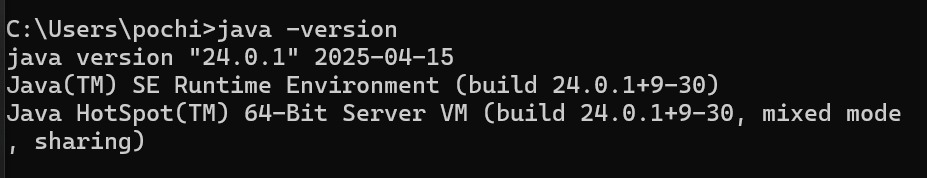
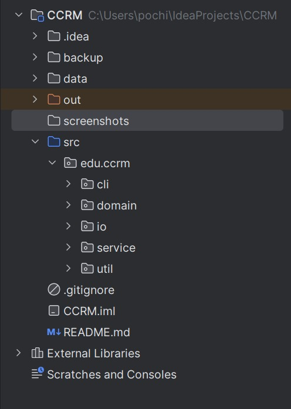
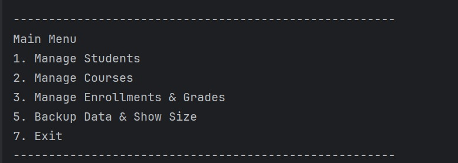
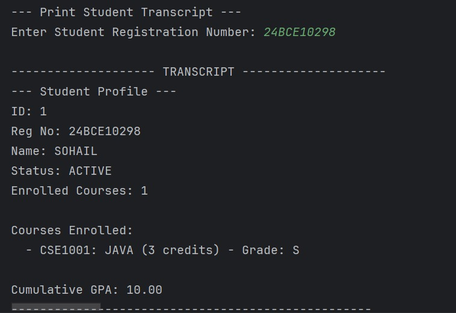
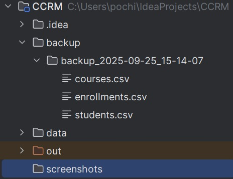

# Campus Course & Records Manager (CCRM)

## 1. Project Overview

The Campus Course & Records Manager (CCRM) is a console-based Java SE application designed for an educational institute to manage student records, course catalogs, enrollments, and grades. It serves as a practical demonstration of core and advanced Java concepts, including Object-Oriented Programming (OOP), modern file I/O with NIO.2, the Streams API, and foundational design patterns.

**Core Features:**
* **Student Management:** Add, update, and find students.
* **Course Management:** Add, update, and find courses.
* **Enrollment & Grading:** Enroll students in courses, assign grades, and calculate GPA.
* **Reporting:** Generate formatted student transcripts.
* **Data Persistence:** Export data to CSV files and import it on startup.
* **File Utilities:** Backup application data to timestamped archive folders and recursively calculate backup size.

---

## 2. How to Run the Application

### Prerequisites
* **Java Development Kit (JDK):** Version 17 or higher.
* **IDE:** IntelliJ IDEA or Eclipse.
* **Git:** For cloning the repository.

### Steps
1.  **Clone the Repository:**
    ```bash
    git clone <YOUR_GIT_REPOSITORY_LINK>
    cd ccrm-java-project
    ```
2.  **Open in IntelliJ IDEA:**
    * Open IntelliJ.
    * Select `File` -> `Open...` and choose the cloned project folder.
3.  **Run the Application:**
    * Locate the main class `CCRMApp.java` in the `src/edu/ccrm/cli` package.
    * Right-click on the file and select `Run 'CCRMApp.main()'`.

---

## 3. Core Java Concepts Explained

### Evolution of Java

* **1995:** Java 1.0 released by Sun Microsystems.
* **2004:** Java 5 released, adding major features like Generics, Enums, and Annotations.
* **2014:** Java 8 released, a landmark version introducing Lambda Expressions, the Stream API, and a new Date/Time API.
* **2021:** Java 17 released as the latest Long-Term Support (LTS) version.

### Java ME vs. SE vs. EE

| Feature         | Java ME (Micro Edition)                             | Java SE (Standard Edition)                      | Java EE (Enterprise Edition)                                    |
|-----------------|-----------------------------------------------------|-------------------------------------------------|-----------------------------------------------------------------|
| **Primary Use** | Resource-constrained devices (IoT)                  | Desktop, server, and console applications       | Large-scale, distributed, and web-based enterprise applications |
| **Core API**    | A subset of Java SE API + device-specific libraries | The core Java platform (lang, util, io, etc.)   | Java SE + APIs for web services, servlets, persistence (JPA)    |
| **Example App** | Embedded device controllers                         | **This CCRM Project**, Minecraft (Java Edition) | E-commerce websites, banking systems                            |

### Java Architecture: JDK, JRE, JVM

* **JVM (Java Virtual Machine):** An abstract machine that provides a runtime environment to execute Java bytecode. It is the component that makes Java "platform-independent."
* **JRE (Java Runtime Environment):** A software package that contains the JVM, core libraries, and other files needed to *run* a Java program.
* **JDK (Java Development Kit):** A superset of the JRE. It contains everything in the JRE, plus the development tools (like the `javac` compiler) needed to *create* Java applications.

---

## 4. Setup and Configuration (with Screenshots)


* **JDK Installation Verification (`java -version`):**
  

* **IntelliJ IDEA Project Setup:**
  

---

## 5. Syllabus Topic to Code Mapping


| Syllabus Topic                       | File / Class / Method Where Demonstrated                              |
|--------------------------------------|-----------------------------------------------------------------------|
| **Packages**                         | `edu.ccrm.cli`, `edu.ccrm.domain`, `edu.ccrm.service`, etc.           |
| **Decision Structures (if, switch)** | `CCRMApp.java` (main menu `switch`), `EnrollmentService.java` (`if`)  |
| **Loops (for, while)**               | `CCRMApp.java` (`while` for menus), `FileService.java` (`forEach`)    |
| **OOP (Inheritance)**                | `Student.java extends Person`                                         |
| **OOP (Abstraction)**                | `Person.java` (abstract class)                                        |
| **OOP (Polymorphism)**               | `student.getProfile()` in `findStudent()`                             |
| **Enums with Constructors**          | `Grade.java`                                                          |
| **Design Pattern: Builder**          | `Course.CourseBuilder` in `Course.java`                               |
| **Exception Handling (try-catch)**   | `CCRMApp.java` (handling `InputMismatchException`)                    |
| **NIO.2 (Path, Files)**              | `FileService.java` (`Files.lines`, `Files.copy`, `Files.walk`)        |
| **Streams API & Lambdas**            | `EnrollmentService.java` (`calculateGpa`), `FileService.java` (`map`) |
| **Date/Time API**                    | `FileService.java` (`backupData` for timestamp)                       |
| **Recursion**                        | `RecursiveUtils.java` (`calculateDirectorySize()`)                    |

---

## 6. Project In Action (Screenshots)

* **Main Menu:**
  
* **Student Transcript:**
  
* **Backup Folder Structure:**
  